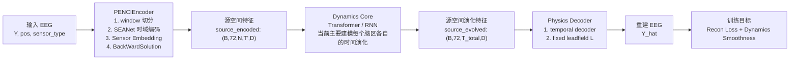
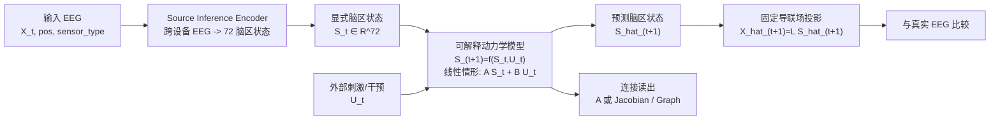

# 方案 A Plus：基于正向物理约束的端到端神经动力学推断框架

## 1. 核心定义 (Core Concept)

- **模型本质：** 构建一个“传感器 -> 源空间 -> 传感器”的物理约束闭环模型。
- **核心逻辑：** 将 EEG 先映射到统一的 72 脑区源空间，再在源空间中建模脑区状态的时间演化，最后通过固定导联场矩阵投影回电极空间进行物理一致性验证。
- **当前版本的训练公式：**

$$
\hat{Y} = L \times \mathrm{Decoder}_{time}\big(\mathrm{Dynamics}(\mathrm{Encoder}(Y, pos, type))\big)
$$

其中，$L$ 是固定的导联场矩阵。

- **目标版本的建模公式：**

$$
\begin{aligned}
X_t &= L S_t + \epsilon_t \\
S_{t+1} &= f_\theta(S_t, U_t)
\end{aligned}
$$

其中：

- $X_t$：时刻 $t$ 的 EEG 观测
- $S_t$：时刻 $t$ 的 72 脑区状态
- $U_t$：外部刺激或干预输入
- $L$：固定导联场矩阵
- $f_\theta$：待学习的脑区动力学模型

> 这一定义将“观测模型”和“连接动力学”分开：导联场负责脑区到电极的物理映射，动力学模块负责脑区到脑区的时间因果传播。
>
> 同时还必须满足一个当前实现里的关键工程前提：
> **训练目标 EEG 和导联场矩阵必须处在同一个传感器空间。**
> 也就是说，通道顺序、通道集合、参考方式和前向尺度约定必须一致；
> 不允许把逐段自适应缩放后的 EEG 直接和原始 leadfield 做物理闭环。

---

## 2. 模型架构 (Model Architecture)

### 2.1 当前版本 PENCI 的实现架构

当前代码已经实现的是一个“跨设备 EEG 编码 + 源空间时序特征建模 + 固定导联场重建”的物理约束重建模型。

### 模块一：通用编码器 (Universal Encoder) —— “观察者”

- **来源：** 复用 BrainOmni (NeurIPS 2025) 的 `Sensor Encoder` 和 `Cross-Attention` 模块。
- **输入：** 任意通道的原始 EEG 信号 + **电极的三维坐标** $(x, y, z)$。
- **功能：** 解决跨设备通道不统一的问题，将不同排布的传感器数据映射为一个统一的、潜在的源空间特征表示。
- **关键修改：** 弃用 BrainOmni 原有的量化层（RVQ）和解码器，仅保留其特征提取能力，输出连续的向量以保留动力学特征。

### 模块二：动力学核心 (Dynamics Core) —— “虚拟脑”

- **来源：** 你的原创部分（方案A核心）。
- **结构：** Transformer（推荐）或 RNN/LSTM。
- **当前功能：** 对源空间特征做时间建模，帮助提升 EEG 重建质量。
- **当前限制：** 现有实现尚未显式输出脑区到脑区的连接矩阵，也未显式引入外部刺激输入，因此还不能直接解释为“可读出的有效连接模型”。

### 模块三：物理解码器 (Physics Decoder) —— “物理裁判”

- **来源：** 传统的神经电生理物理模型。
- **结构：** 固定的导联场矩阵 (Fixed Lead Field Matrix, $L$)。
- **状态：** 不可训练 (Frozen / Requires_grad=False)。
- **功能：** 作为硬性物理约束，将预测的源信号投影回传感器空间 $(Y = L \times S)$，通过最小化重构误差来倒逼模型学习合理的源空间表示。

> **⚠️ 重要技术要点：导联场矩阵的通道匹配性**
>
> 导联场矩阵 $L$ 的形状必须严格为 `(n_channels, n_sources)`，其中：
> - `n_channels`：实际 EEG 数据的电极数量（如 64、128 等）
> - `n_sources`：源空间的脑区数量（本方案固定为 72）
>
> **不同通道配置需要不同的导联场矩阵：**
> - 如果训练数据使用 64 导 BioSemi 设备，需生成 `(64, 72)` 的矩阵
> - 如果训练数据使用 128 导 EGI 设备，需生成 `(128, 72)` 的矩阵
> - 即使通道数相同，但电极位置不同（如不同品牌的 64 导帽），也需生成不同的矩阵
>
> **除了通道匹配，还要保证传感器空间匹配：**
> - 如果真实 EEG 已做 average reference，则 reconstruction 比较时也必须使用同一参考系
> - 如果观测数据做了与样本绑定的逐段缩放，而该缩放未显式进入 forward model，则不能直接与固定 $L$ 比较

### 2.2 目标版本：可解释脑区连接输出架构

目标版本不再只满足“EEG 能重建”，而是要显式区分：

- 源空间状态估计
- 脑区间动力学传播
- 外部刺激或干预输入
- 导联场物理投影

### 2.3 当前版本与目标版本的关键差距

- **缺少显式脑区状态变量：** 当前源空间仍是高维特征 `(72, D)`，还不是便于解释的低维脑区状态 $S_t$。
- **缺少显式连接矩阵：** 当前 Dynamics Core 没有直接输出 $72 \times 72$ 的脑区连接结构。
- **缺少干预输入通道：** 目前模型里没有单独的 $U_t$，不能区分“系统当前状态”和“外部刺激”。
- **缺少面向连接的损失函数：** 当前训练主要优化 EEG 重建和时间平滑，尚未直接约束源空间 one-step prediction、连接稀疏性或稳定性。
- **缺少面向连接的验证路径：** 目前可以评估重建，但还不能严格评估连接是否正确，需要仿真或已知干预数据做 ground truth 检验。

---

## 3. 分阶段训练方案 (Phased Training Plan)

为兼顾跨设备鲁棒性、源空间物理锚定和连接可解释性，推荐采用四阶段训练策略，而不是从一开始就将 Encoder 与 Dynamics Core 完全端到端绑定训练。

### 阶段 0：结构对齐与权重复用初始化

- **目标：** 复用 BrainOmni 在“跨设备 EEG + 电极坐标编码”上的先验能力。
- **操作：**
  1. 对齐 PENCI 的编码器超参数，使其尽可能兼容 BrainTokenizer 权重。
  2. 仅迁移 BrainTokenizer 中与 `sensor_embed`、`seanet_encoder`、`backwardsolution`、`k_proj` 对应的权重。
  3. 跳过 RVQ、离散 token、以及与 `16 -> 72` 不兼容的 latent query 参数。
- **输出：** 一个具备跨设备 EEG 编码能力的初始化编码器。

### 阶段 1：源空间锚定预训练 (Source-Space Anchoring)

- **数据：** 大规模 EEG 数据集，可包含不同设备、不同通道数、不同任务类型。
- **目的：**
  1. 让 Encoder 真正学会“不同电极布局 -> 统一源空间表示”。
  2. 让 72 脑区表示先受导联场约束锚定，而不是被 Dynamics Core 提前补偿。
- **操作：**
  1. 保留 Encoder 和固定导联场 Decoder。
  2. 暂不强调复杂动力学，可先弱化、冻结或简化 Dynamics Core。
  3. 主要优化“当前时刻源空间表示能否正确回投到 EEG”。
  4. 训练前先固定真实与仿真的 sensor-space convention，避免 `sim -> real` forward mismatch。
- **核心指标：**
  - 验证集重建指标（Loss / Pearson / SNR / NRMSE）
  - 跨设备泛化能力
  - 仿真源定位一致性

### 阶段 2：可解释动力学训练 (Interpretable Dynamics Training)

- **数据：** 以静息态 EEG 为主；若有真实刺激实验，则额外引入刺激标记。
- **目的：**
  1. 在已锚定的源空间上学习脑区状态的时间传播规律。
  2. 让连接信息来自显式动力学，而不是隐含在黑盒特征中。
- **操作：**
  1. 冻结或基本冻结 Encoder。
  2. 冻结固定导联场 Decoder。
  3. 训练显式动力学模型 $S_{t+1} = f_\theta(S_t, U_t)$。
  4. 若采用线性可解释形式，则直接学习 $A$ 和 $B$。
- **推荐损失：**

$$
\mathcal{L} =
\lambda_1 \left\| X_{t+1} - \hat{X}_{t+1} \right\|^2 +
\lambda_2 \left\| S_{t+1} - \hat{S}_{t+1} \right\|^2 +
\lambda_3 \Omega(A)
$$

其中 $\Omega(A)$ 可取稀疏性、稳定性或解剖先验正则项。

### 阶段 3：小学习率联合校准 (Joint Calibration)

- **目的：** 在不破坏可解释连接结构的前提下，微调 Encoder 与动力学模块之间的接口误差。
- **操作：**
  1. 对 Encoder 的后半部分进行小学习率解冻。
  2. 保持导联场矩阵冻结。
  3. 保持动力学模块的显式连接结构不变。
- **注意：** 该阶段是“校准”，不是重新回到完全黑盒的端到端训练。

### 阶段 4：NPI 推断与连接图谱生成

- **目标：** 在训练完成后，从已冻结的动力学模型中导出可解释脑区连接。
- **操作：**
  1. 获取基线脑区状态 $S_t$。
  2. 对某脑区施加微小扰动或显式刺激输入 $U_t$。
  3. 计算下一时刻预测状态变化 $\Delta S_{t+1}$。
  4. 遍历所有脑区，构建全脑有效连接矩阵。

---

## 4. 推断方法 (Inference Method)

模型训练完成后，使用 **神经扰动推断 (NPI)** 对虚拟脑进行“手术”。其前提是：动力学模块必须提供可解释的脑区状态传播机制，而不能仅仅是黑盒时间特征变换。

1. **冻结模型：** 停止参数更新，进入 Eval 模式。
2. **获取基线：** 输入一段基线数据，得到脑区状态 $S_t$ 及其下一时刻预测 $S^{base}_{t+1}$。
3. **施加扰动：**
   - 若有显式刺激输入，则在 $U_t$ 中对脑区 $i$ 注入微扰。
   - 若无显式刺激输入，则直接在 $S_t$ 的第 $i$ 个脑区施加微小扰动 $\delta$。
4. **观察响应：** 重新演化一步，得到 $S^{pert}_{t+1}$，并计算差值向量：

$$
\Delta_i = S^{pert}_{t+1} - S^{base}_{t+1}
$$

5. **构建图谱：** $\Delta_i$ 中第 $j$ 个分量表示“脑区 $i$ 的微扰对脑区 $j$ 的影响强度”。遍历所有脑区，得到全脑有效连接矩阵。

---

## 5. 验证策略（验证策略）

为了应对“源定位不适定性”的学术质疑，需进行多层次验证：

- **仿真验证（必做）：**
  - 构建具有已知 Ground Truth 连接的仿真数据集。
  - 同时验证两件事：源空间映射是否正确、连接传播是否正确。
  - 证明模型能在固定导联场约束下恢复设定的因果结构，未陷入“只会重建 EEG，但连接是假的”。
- **拓扑/常识验证：**
  - 检查推断出的连接是否符合神经解剖学常识（如半球内连接强于半球间连接，视觉区到额叶的信息流）。
- **跨设备一致性验证：**
  - 使用不同电极布局、不同 EEG 设备的数据，检查映射到 72 脑区后的结果是否稳定。
- **干预一致性验证：**
  - 如果存在真实刺激实验，验证模型推断的传播方向、时延和响应脑区是否与实验结果一致。
